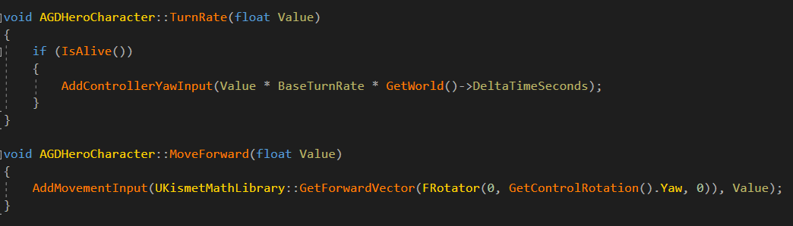

本文仅介绍普通移动，RootMotion相关的移动会在下篇文章中介绍。

# 1 流程图

可以下载pdf、visio版本查看修改，链接在https://github.com/xiaxia9/blogs/tree/master/UE4/

可以结合大佬们的文章、官方文档以及下面的补充一起看~

- https://zhuanlan.zhihu.com/p/114341957
- https://zhuanlan.zhihu.com/p/34257208
- https://docs.unrealengine.com/4.27/en-US/InteractiveExperiences/Networking/CharacterMovementComponent/

# 2 补充

## 2.1 开启DedicatedServer（ds）

在红框中设置玩家数量和网络模式：

开启后的效果如下，编辑器充当ds，ROLE_AutonomousProxy（客户端）、ROLE_Authority（服务器）、ROLE_SimulatedProxy（模拟端）的区别这里就不多介绍啦：

## 2.2 移动输入设置

以GASDocumentation项目演示，下载地址在这里哦：https://github.com/tranek/GASDocumentation

流程可以分为三步：

- 第一步：在Project  Setting -> Input -> Bindings -> Axis Mappings设置输入映射：

  

- 第二步：在代码中（也可以在蓝图中编写），使用BindAxis()将我们在上一步设置的值与函数绑定起来：

- 第三步：上一步绑定的函数里，会调用AddMovementInput()和AddControllerYawInput()，具体信息请参考《Input》图片里的流程：

  

## 2.3 主要结构

这里介绍一下，网络同步中涉及到的一些重要的结构体，理解这些能够在我们有扩展移动同步数据需求时受益。

**FSavedMove_Character**：描述客户端一次移动的信息。

- TimeStamp：使用FNetworkPredictionData_Client_Character::CurrentTimeStamp作为自己的时间戳。服务器如果判断某个move需要bUpdatePosition，会将该值重新发给客户端，客户端调用ClientUpdatePositionAfterServerUpdate()，并遍历SavedMoves数组。

- 客户端把该结构发送给服务器进行模拟，同步加速度等，并不同步input值等。

**FNetworkPredictionData_Client_Character**：客户端move预测数据

- ClientUpdateTime：上次向服务器发送ServerMove()的时间戳。
- CurrentTimeStamp：每次累加DeltaTime，超过一定的数值后会重置。
- SavedMoves：客户端本地维护的移动缓存数组，按从最旧到最新顺序排列。里面存储的是客户端已模拟，但还没收到服务器ack的move数据。
- LastAckedMove：上次确认被发送的移动指针，FSavedMove_Character类型。
- PendingMove：用于存储移动。等待与下一个移动结合以减少客户端到服务器的带宽。（比如：一些没变化的移动包，会合并发送，以减少带宽）
- IsImportantMove()：如果未收到服务器ack时，需要再次发送时，返回true；否则，返回false。（也就是说，一些比较重要的移动包，需要再次发送的，会在这里判断。MovementMode或Acceleration不同，都会标记为重要的move）

**FCharacterServerMovePackedBits**：客户端和服务器在网络上传输的数据结构。

**FCharacterNetworkMoveData：**客户端发送到服务器的移动同步包。

**FCharacterNetworkMoveDataContainer**：FCharacterServerMovePackedBits反序列化得到的结构数据。

- 包含NewMoveData、PendingMoveData、OldMoveData

**FCharacterMoveResponseDataContainer**：与上面的结构体相对应，这是服务器发送给客户端的同步包。

## 2.4 扩展移动同步

这里仅提供一种方法，具体实践请遵守项目需求。

客户端数据扩展：

- 扩展移动快照（FSavedMove_Character）：重写PostUpdate()对变量进行赋值，有时候还需要重写Clear()清理变量。
- 由于我们使用新的移动快照，所以需要重写FNetworkPredictionData_Client_Character::AllocateNewMove()来new我们自定义的移动快照。
- 扩展网络上一次move的数据包FCharacterNetworkMoveData。重写ClientFillNetworkMoveData()，如果用到自定义的移动快照，可以转换传入的参数，然后取出数据。重写Serialize()进行序列化。
- 扩展网络同步的数据包容器FCharacterNetworkMoveDataContainer。它包括NewMoveData、PendingMoveData、OldMoveData，这里简单的与FCharacterNetworkMoveData扩展包关联起来即可。还有，要在移动组件构造函数中调用SetNetworkMoveDataContainer()进行设置。

服务器数据扩展：

- 扩展网络同步的数据包容器FCharacterMoveResponseDataContainer。这里更像是上面说的FCharacterNetworkMoveData扩展结构包，重写ServerFillResponseData()、Serialize()即可。还有，要在移动组件构造函数中调用SetMoveResponseDataContainer()进行设置。

模拟端数据扩展：

- 扩展其他数据：新建自己的Character类。重写GetLifetimeReplicatedProps()方法，添加自己想要同步的变量及标识。重写PreReplication()方法，对同步变量赋值。

最后，如有错误，烦请指正！谢谢~

